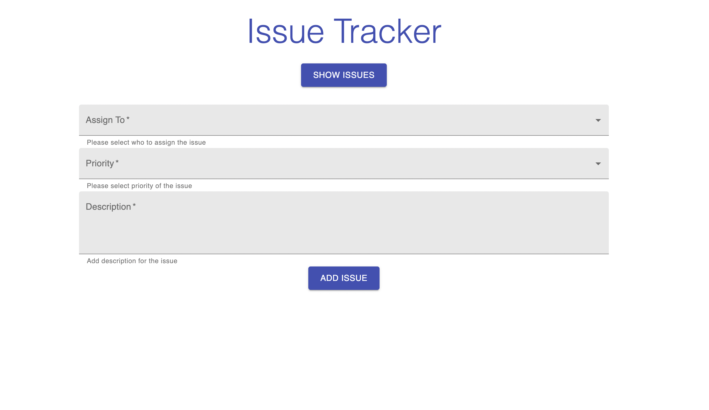

# Simple Issue Tracker




### About the project

School Docker project. Assignment was to create application and make it so you can run it in docker.
Applications frontend is build with React framework, backend uses node.js and MongoDB is the database.
Very simple application where you can add, view and delete issues from database.

### Built With

- [React](https://reactjs.org/)
- [MongoDB](https://www.mongodb.com/)
- [Node.js](https://nodejs.dev/)

### Getting Started

Here is example if you wanna run this project locally with Docker.
You need to have [Docker](https://www.docker.com/) installed.

You can also run this project without Docker.

#### Installation

1. Clone this repo

```sh
git clone https://github.com/Muugmaster/issue-tracker.git
```

2. Go to projects root folder where docker-compose.yml file is and run:

```sh
cd issue-tracker
docker-compose build
```

3. Start containers

```sh
docker-compose up
or
docker-compose up -d
```

4. Open browser and check the site!

```sh
http://localhost:3000
```
